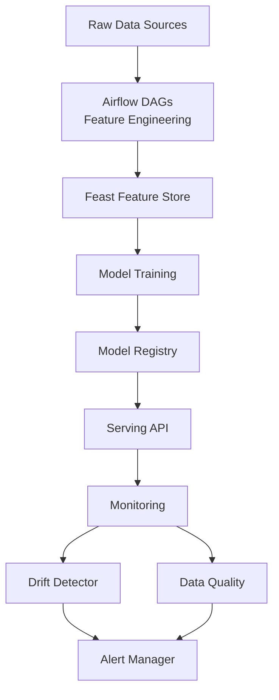

<div align="center">

# MLOps Feature Platform

[](https://github.com/shaikn6/mlops-feature-platform/actions)
[](https://python.org)
[](https://feast.dev)
[](LICENSE)
[](docker-compose.yml)

**Production MLOps platform — Feast feature store, drift detection, model registry, and Airflow pipelines for fintech ML**

</div>

## Architecture



## Components

| Component | Tech | Purpose |
|-----------|------|---------|
| Feature Store | Feast | Offline + online feature serving |
| Pipelines | Airflow DAGs | Feature engineering, training |
| Model Registry | Custom | Versioning, metadata, lineage |
| Drift Detection | Statistical | PSI, KS test, population stability |
| Monitoring | Dashboard | Data quality, model health |
| API | FastAPI | Feature serving endpoint |

## Quick Start

```bash
git clone https://github.com/shaikn6/mlops-feature-platform
cd mlops-feature-platform && cp .env.example .env
docker compose up -d
# API: http://localhost:8000/docs
```

## Development

```bash
pip install -e ".[dev]"
pytest tests/ -v --cov=.
ruff check . --ignore E501
```

## License

MIT
