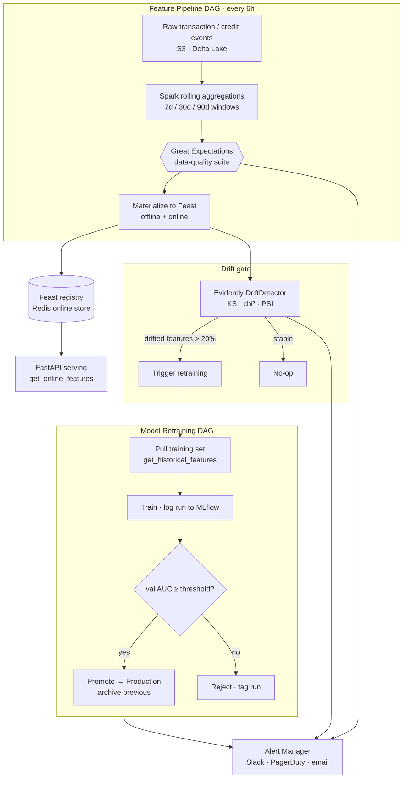

<div align="center">

# MLOps Feature Platform

[](https://github.com/shaikn6/mlops-feature-platform/actions)
[](https://python.org)
[](https://feast.dev)
[](LICENSE)
[](docker-compose.yml)

**Feature platform for fintech ML — Feast feature store, Spark rolling-window aggregations, Evidently drift detection, and a drift-gated Airflow retraining loop.**

</div>

This repository wires the pieces a fraud/credit ML system needs to stay healthy in production: point-in-time-correct features served from Feast, statistical drift monitoring that decides *when* to retrain, and an Airflow pipeline that closes the loop by promoting models through MLflow only when they clear a validation gate.

## Architecture



Every box above maps to a real module — see [Components](#components). The two design decisions worth calling out:

1. **Drift drives retraining, not a cron.** The feature pipeline runs a `BranchPythonOperator` on the Evidently report; the retraining DAG only fires when the dataset-drift ratio crosses the threshold, so compute is spent when the data has actually moved.
2. **Promotion is gated, not automatic.** A newly trained model is logged to MLflow but only transitioned to `Production` (archiving the previous version) when validation AUC clears the configured threshold; otherwise the run is tagged `rejected` with the reason.

## Components

| Component | Module | Tech | What it does |
|-----------|--------|------|--------------|
| Feature definitions | `feature_store/feature_repo/features.py` | Feast | `customer_transaction_features` (spend/fraud rolling windows) + `credit_features` (utilization, DTI, payment history) |
| Feature serving | `feature_store/serving.py` | Feast + Redis | Online lookups for fraud/credit models; point-in-time training joins |
| Registry / materialization | `feature_store/registry.py` | Feast | `apply`, incremental + full materialization, schema introspection |
| Spark feature computation | `pipelines/spark/feature_computation.py` | PySpark | 7d/30d/90d `Window` aggregations, dedup-to-latest |
| Data quality | `monitoring/data_quality.py` | Great Expectations | In-memory suites for transactions, credit bureau, feature output, training sets |
| Drift detection | `monitoring/drift_detector.py` | Evidently AI | KS / chi² stat tests + PSI; per-feature + dataset-level retrain recommendation |
| Alerting | `monitoring/alert_manager.py` | Slack · PagerDuty · email | Severity-routed alerts for drift, DQ failures, registrations, retrains |
| Pipelines | `pipelines/dags/*.py` | Airflow | Feature pipeline (drift-gated) + retraining DAG (train → evaluate → promote/reject) |
| Serving API | `api/`, FastAPI | FastAPI · Uvicorn | Feature-serving endpoint |

## How it works

No benchmark numbers are claimed here because the platform is a framework, not a trained model — the thresholds below are the **design parameters** it operates on, not measured results.

**Drift methodology.** `DriftDetector` wraps Evidently's `DatasetDriftMetric` + `DataDriftTable`. Numeric columns default to the **KS test**, categorical to **chi-squared**, and **PSI** (Population Stability Index) is computed for every numeric feature as a supplementary credit-risk signal. PSI is bucketed against industry-standard bands — `< 0.10` no change, `0.10–0.20` monitor, `> 0.25` retrain. A retrain is recommended once **> 20%** of features drift (`DATASET_DRIFT_THRESHOLD`); all thresholds are constructor-overridable.

**Data-quality methodology.** Suites are defined in-memory (no GE project on disk) so the same checks run from Airflow tasks, CI, and notebooks. Transaction validation enforces schema presence, primary-key/timestamp non-null, `amount ∈ (0.01, 1M)`, a known `transaction_type` enum, and `transaction_id` uniqueness; a failed suite blocks materialization and raises a DQ alert.

**Rolling features.** Spark computes per-user 7/30/90-day aggregations over an `event_timestamp`-ordered window, with a 5-day lookback buffer beyond the 90-day window to keep edge windows complete, then deduplicates to the latest row per key before materializing into Feast.

**Promotion gate.** Validation AUC is compared against `promotion_auc_threshold` (default `0.82`, an Airflow Variable). The retraining DAG branches to `promote_model` (MLflow stage → Production, previous versions archived) or `reject_model` (run tagged with the failing AUC).

Correctness is covered by **305 tests across 12 files** (`tests/`), exercising the drift detector, DQ suites, alert routing, feature serving/registry, and both DAGs.

## Quickstart

```bash
git clone https://github.com/shaikn6/mlops-feature-platform
cd mlops-feature-platform && cp .env.example .env

# Run the serving API + Redis online store
docker compose up -d
# API docs: http://localhost:8000/docs
```

Local development:

```bash
pip install -e ".[dev]"
pytest tests/ -v --cov=.
ruff check . --ignore E501
```

Apply Feast definitions and materialize features:

```bash
python -c "from feature_store.registry import FeatureRegistry; FeatureRegistry().apply()"
```

Kubernetes manifests for Airflow and the Spark operator live in `k8s/`.

## Tech stack

Python 3.11 · Feast · Redis · PySpark · Evidently AI · Great Expectations · MLflow · Apache Airflow · FastAPI · Uvicorn · Docker · Kubernetes

## License

MIT
